 

 

<h3><code>musab@github ~ $ ./contributions.sh</code></h3>

  

<h3><code>musab@github ~ $ neofetch</code></h3>
<table>
  <tr>
    <td valign="top"></td>
    <td valign="top"></td>
  </tr>
</table>

 

## ▍ Featured work

Every project is a full case study: the question, the method, reconciled results, and stated limitations. Numbers are traceable to the source data and the code in each repository.

### Newest: Power BI data products on official public data

| Project | What it is | Proof |
|---|---|---|
| **[jordanian-unemployment-2025-2026](https://github.com/musab-abukaraki-66/jordanian-unemployment-2025-2026)** · [live preview](https://musab-abukaraki-66.github.io/jordanian-unemployment-2025-2026/) | A Jordanians-only, source-traced Power BI data story on official Department of Statistics releases | Ten flat quarters at 21.0–21.5%, and a three-page report that separates definitions, periods, gender and age |
| **[hospital-atlas-ed-pressure-room](https://github.com/musab-abukaraki-66/hospital-atlas-ed-pressure-room)** | Interactive report on real CMS Care Compare data: a fingerprint atlas of hospitals plus an ED pressure room | 3,107 hospitals drawn as roses with DAX that returns SVG. No custom visuals, no Deneb |
| **[federal-contracting-intelligence](https://github.com/musab-abukaraki-66/federal-contracting-intelligence)** | Executive Power BI product over the complete FY2025 U.S. federal prime-contract record | 6.64M contract actions and $793.2bn obligated, from a 13.6 GB archive into a 187 MB model that refreshes in about two minutes |
| **[jordan-economic-pulse](https://github.com/musab-abukaraki-66/jordan-economic-pulse)** | Four-page case study of Jordan's external gap, growth and prices (World Bank and Central Bank of Jordan) | Star-schema model with DAX reconciled to an independent baseline |

### Full-stack and machine learning

| Project | What it is | Proof |
|---|---|---|
| **[orbit](https://github.com/musab-abukaraki-66/orbit)** · [live demo](https://orbit-ten-cyan.vercel.app) | Real-time collaborative project management for small teams | Next.js 16, Supabase (Postgres, Auth, RLS, Realtime), Playwright e2e, deployed on Vercel |
| **[aerial-car-detection](https://github.com/musab-abukaraki-66/aerial-car-detection)** | YOLOv8s fine-tuned to detect cars in aerial imagery | 96.78% mAP@0.5, 94.92% precision, 95.01% recall; full pipeline, CLI and desktop GUI |

### Analytics, BI and automation foundations

| Project | What it is | Proof |
|---|---|---|
| **[retail-performance-intelligence](https://github.com/musab-abukaraki-66/retail-performance-intelligence)** | SQL and Python retail analytics | Window functions, CTEs and RFM segmentation; five business questions, each answered by an executed query |
| **[saas-subscription-bi](https://github.com/musab-abukaraki-66/saas-subscription-bi)** | Subscription BI: star schema, KPI design, dashboard analysis | MRR, churn and cohort retention; every DAX measure cross-checked against executed SQL |
| **[support-ops-report-automation](https://github.com/musab-abukaraki-66/support-ops-report-automation)** | Validate, clean and transform a raw weekly export into Excel and PDF reports | 9 passing unit tests |
| **[ai-augmented-anomaly-insights](https://github.com/musab-abukaraki-66/ai-augmented-anomaly-insights)** | Statistical anomaly detection with an AI narration layer | A tested validator blocks the model from inventing numbers |

## ▍ Toolbox

| Area | Tools |
|---|---|
| **Business intelligence** | Power BI (PBIP/PBIR) · DAX · Power Query · star-schema modelling · SVG-in-DAX visuals |
| **Data and analysis** | Python · SQL · pandas · NumPy · scikit-learn · Excel · statistics |
| **Machine learning** | PyTorch · Ultralytics YOLOv8 |
| **Web and data engineering** | TypeScript · Next.js · Supabase / Postgres · Playwright · Vercel |
| **Practice** | Source tracing · reconciliation to a baseline · pytest · Git/GitHub · GitHub Actions |

## ▍ Get in touch

[LinkedIn](https://www.linkedin.com/in/musababukaraki) · [musababukaraki1@gmail.com](mailto:musababukaraki1@gmail.com)

The art above is generated by the scripts in [`scripts/`](scripts). The contribution graph refreshes daily from public data with GitHub Actions: no third-party stats service, no token, no JavaScript.
